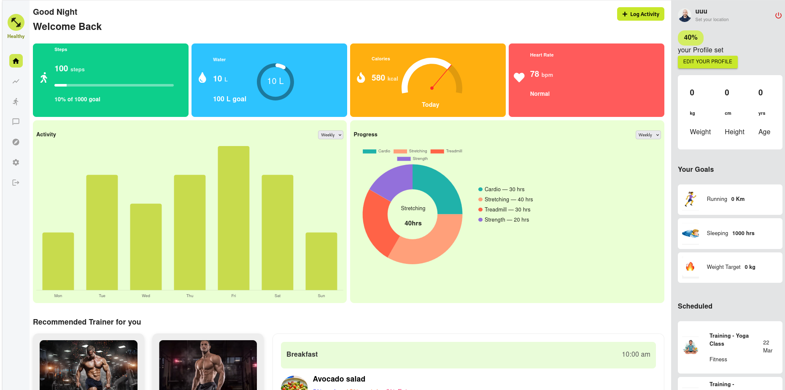

# Fitness Tracker

A full-stack fitness tracking web application built with **Node.js**, **Express**, **React**, and **TypeScript**.  
Track your steps, water intake, calories, heart rate, workouts, and more — all in one place.

##  Features

- **Profile Management** (weight, height, age, location)
- **Fitness Metrics Tracking**:
  - Steps
  - Water Intake
- **Activity Graphs** (Weekly)
- **Progress Charts** (Cardio, Strength, Stretching, etc.)
- **Goal Setting** (Running, Sleeping, Weight Loss)
- Responsive and modern UI (MUI + Chart.js)


##  Tech Stack

### **Frontend**
```bash
- React 18 + TypeScript
- Material UI (MUI)
- Chart.js / Recharts
```

### **Backend**
- Node.js
- Express.js
- TypeScript
- PostgreSQL (TypeORM)


##  How to run this:

### 1. Clone the Repository
```bash
git clone https://github.com/khalidCD/fitness-tracker.git
cd fitness-tracker
```
### 2.Install Dependencies
**Backend**
```bash
cd server
yarn install
```
**Frontend**
```bash
cd Client
yarn install
```
### Example API Routes
**Auth**
```bash
// POST /api/auth/register
// POST /api/auth/login
```
**Profile**
```bash
// GET /api/profile
// PUT /api/profile
```
### Run command :
**Backend**
```bash
cd Server
yarn dev
```
**Frontend**
```bash
cd Server
yarn dev
```
**Login**

**Register**

**Dashboard**

**Database**
